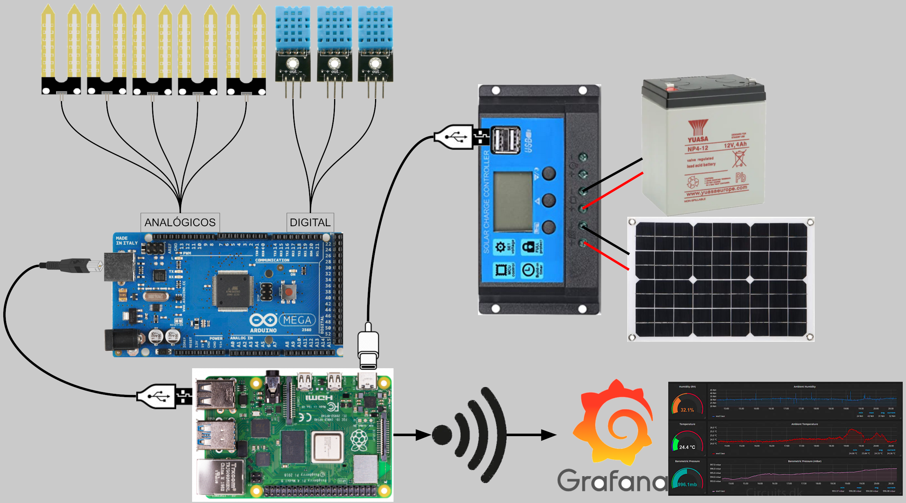

# Invernadero IoT
# Objetivo
Construir un mini-invernadero para semilleros durante finales de invierno y monitorizar su evolución
# Materiales
Los materiales se pueden cambiar, están sobredimensionados pero era la primera prueba.
- Invernadero construido con codos y tuvos PVC y paredes de plástico de Poliestireno
- Raspberry con wifi para almacenar datos y controlar Arduino.
  - Webcam
- Ardunio Mega 2560
  - 2 Sensores de humedad y temperatura DHT11, para temperatura interior y temperatura exterior
  - Sensores de humedad de tierra YL-38 o YL-69 para controlar humedad de la tierra
- Placa solar a 5V (https://www.amazon.es/gp/product/B07Z4XST24/ref=ppx_yo_dt_b_search_asin_image?ie=UTF8&psc=1)
- Batería 12V
# Esquema

# Invernadero
